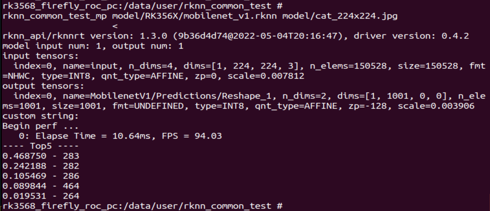
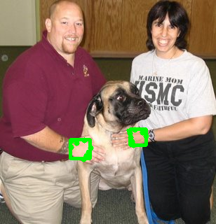

## Introduction

In this project, we aim to porting Mediapipe to Rockchip's platforms and chips, including RK3566/RK3568, RK3588, RV1126, RK3399/RK3399Pro, and etc.

## Install and Build on RK3568

- Git clone this repo, and checkout to the `dev` branch
- Setup Java Runtime, Android-SDK, Android-NDK according to Mediapipe (https://google.github.io/mediapipe/getting_started/android.html)
- Setup bazelisk (https://docs.bazel.build/versions/main/install-bazelisk.html)
- Build the target xxx as following that
```shell
bazelisk build xxx --config=android_arm64
```

## Examples

1. rknn_common_test  



TODO

2. palm_detection_rknn  



TODO

## Contact Us

If there is any question, please contact us through: 

- Email:  3113291906@qq.com 
- WeChat: ShaugarDolley

